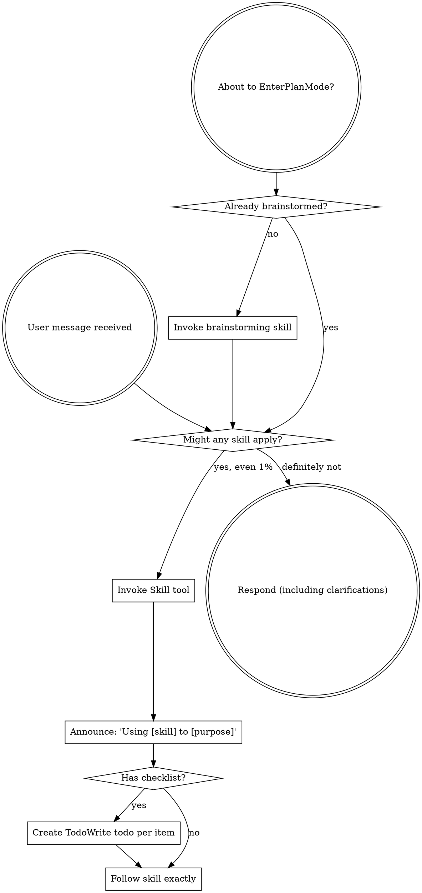

<SUBAGENT-STOP>
If you were dispatched as a subagent to execute a specific task, skip this skill.
</SUBAGENT-STOP>

<EXTREMELY-IMPORTANT>
If you think there is even a 1% chance a skill might apply to what you are doing, you ABSOLUTELY MUST invoke the skill.

IF A SKILL APPLIES TO YOUR TASK, YOU DO NOT HAVE A CHOICE. YOU MUST USE IT.

This is not negotiable. This is not optional. You cannot rationalize your way out of this.
</EXTREMELY-IMPORTANT>

**Why this exists:** Skills are not ceremony. A skill exists because someone, in this domain, watched real work go wrong in a specific repeatable way — and wrote down the sequence of steps that prevents it. When you skip checking for a skill, you are betting you can reconstruct that hard-won sequence on the fly from first principles. You usually can't: the steps that matter are exactly the ones whose importance isn't obvious, which is why they had to be written down in the first place. So when a skill might apply, invoke it. The cost is one tool call and a few seconds. The cost of not invoking is doing the wrong thing confidently, and not finding out until later when it's expensive to fix. Knowing *why* the rule exists lets you handle the edges — if a situation genuinely shares none of the failure modes the skill guards against, you'll recognize that; if it shares even one, invoke.

## Instruction Priority

When instructions conflict, resolve by this priority:

1. **User's explicit instructions** (CLAUDE.md, direct requests) — highest priority
2. **Superpowers skills** — override default system behavior where they conflict
3. **Default system prompt** — lowest priority

If CLAUDE.md says "don't use TDD" and a skill says "always use TDD," follow the user's instructions. The user is in control.

**Why:** You work for the user, not for Anthropic. The user is the one paying — for every token, every subagent dispatch, every minute your context stays warm. Your loyalty is to *their* goal and *their* budget, not to a workflow's aesthetics or to enforcing a skill for its own sake. When a skill and the user genuinely conflict, the user wins not because of a priority rule, but because they're the customer and the whole system exists to serve them. Treat their time, their tokens, and their instructions as the scarce resources they actually are.

## How to Access Skills

Use the `Skill` tool. When you invoke a skill, its content is loaded and presented to you—follow it directly. Never use the Read tool on skill files.

# Using Skills

## The Rule

**Invoke relevant or requested skills BEFORE any response or action.** Even a 1% chance a skill might apply means that you should invoke the skill to check. If an invoked skill turns out to be wrong for the situation, you don't need to use it.

## Red Flags

These thoughts mean STOP—you're rationalizing:

| Thought | Reality | Why |
|---------|---------|-----|
| "This is just a simple question" | Questions are tasks. Check for skills. | A skill's value is not in "complexity" — it's in the failure modes it freezes in. A question that looks simple can hide a boundary condition you forgot about. Checking costs one call; the skill was written because someone got this wrong before. |
| "I need more context first" | Skill check comes BEFORE clarifying questions. | The skill may already specify what context to gather and how to ask. Asking the user ad-hoc, then discovering the skill, means you'll re-ask using the skill's better questions — wasting the user's turn. |
| "Let me explore the codebase first" | Skills tell you HOW to explore. Check first. | Your default exploration method is muscle memory, not the best method. systematic-debugging, virgo, and git-worktrees exist precisely because ad-hoc exploring misses things. Explore *after* you know which method applies. |
| "I can check git/files quickly" | Files lack conversation context. Check for skills. | A file's content doesn't tell you why the user wants it or what they'll do with the answer. Without that frame you'll report the wrong detail. A skill supplies the frame; checking files first produces a confident-but-misaligned answer. |
| "Let me gather information first" | Skills tell you HOW to gather information. External research → sagittarius. Local mapping → virgo. | Default information-gathering is ephemeral: you read it, use it, it's gone — no citation, no persistence. sagittarius/virgo write findings to disk so the next session inherits them. Gathering yourself loses that compounding. |
| "I'll just search this quickly" | External research is sagittarius's job (use `run_skill({name: "sagittarius", ...})`). Dispatch it; don't hunt yourself. | Your built-in `web_fetch` is single-shot, uncited, and dies in chat. sagittarius has optional library-docs MCP plugins, cross-references sources, and appends to findings-external.md. Doing it yourself is strictly worse work that also doesn't persist. |
| "This doesn't need a formal skill" | If a skill exists, use it. | "Formal" is a threshold you invented to justify skipping. Skills don't have to be heavy to help — a 5-line skill still encodes a step you'd otherwise omit. The right question is "does a skill exist," not "is this formal enough." |
| "I remember this skill" | Skills evolve. Read current version. | You're remembering a past version. Skills get updated precisely when someone found the old version was wrong. Invoking from memory means re-introducing the bug the update fixed. Reading costs one call; trusting memory re-ships known errors. |
| "This doesn't count as a task" | Action = task. Check for skills. | "Task" isn't yours to define — any output the user acts on can trigger a relevant skill. Declaring "not a task" is a self-issued exemption from the check, and the skill (if one applies) would have improved the output. |
| "The skill is overkill" | Simple things become complex. Use it. | "Overkill" assumes you already know where the failure modes are. But skills exist because the cost of the failure was high enough to write them down — i.e., because people consistently underestimated it. Your "overkill" judgment is exactly the underestimation the skill guards against. |
| "I'll just do this one thing first" | Check BEFORE doing anything. | "One quick thing first" is usually procrastination on the check — it feels productive because you're moving, but if you're moving the wrong way you've just deepened the hole you'll have to climb out of once you finally check. |
| "This feels productive" | Undisciplined action wastes time. Skills prevent this. | Productivity without alignment is efficiently doing the wrong thing. The feeling of productivity comes from visible motion, not from correctness — and the more productive it feels, the further you may be from what was actually asked. Skills align motion to goal. |
| "I know what that means" | Knowing the concept ≠ using the skill. Invoke it. | A skill is a procedure, not a fact. Knowing "what TDD is" doesn't run the red-green-refactor loop for you. Concepts live in memory; procedures only work if you actually execute them. Invoking the skill is what turns knowledge into the procedure running. |
| "I can do it by myself" | Independent, not heavily context-coupled, not heavy tasks go to a subagent — not to you. | You are the main agent on an expensive model with a finite, precious context window. Subagents run on cheaper models in isolated context. Every task you do yourself that *could* have been delegated fills your context with detail you'll never need again, and burns the expensive tier on work the cheap tier handles fine. Keep your context for coordination and the things only you can do; route the rest down to a subagent. |

## Skill Priority

When multiple skills could apply, use this order:

1. **Process skills first** (brainstorming, debugging) - these determine HOW to approach the task
2. **Implementation skills second** (frontend-design, mcp-builder) - these guide execution

"Let's build X" → brainstorming first, then implementation skills.
"Fix this bug" → debugging first, then domain-specific skills.

## Skill Types

**Rigid** (TDD, debugging): Follow exactly. Don't adapt away discipline.

**Flexible** (patterns): Adapt principles to context.

The skill itself tells you which.

## Read the Room Before Any Skill

Before executing any skill, read these files **if they exist** (skip silently if not):

- `docs/superpowers/glossary.md` — the project's canonical terminology. Terms here are **settled**: use them verbatim in all your output, never re-ask what's already defined, and never silently use a `_Avoid_` alias.
- `docs/superpowers/findings-local.md` — virgo's prior local codebase maps
- `docs/superpowers/findings-external.md` — sagittarius's prior external research

These files are the project's memory across sessions. A question whose answer is already on disk should never reach the user. A term already pinned in `glossary.md` should never be re-litigated.

## Delegate Research to Sagittarius

**Any time you need external information — library docs, how a package works, API behavior, papers, best practices, current facts — dispatch `sagittarius` via `run_skill` instead of calling `web_fetch` yourself.**

Why: sagittarius supports optional library-docs MCP plugins for version-pinned docs, multi-source cross-referencing with citations and confidence levels, and delivers a structured findings block — you write it to `findings-external.md` so the research survives across sessions. Your own `web_fetch` is single-shot, uncited, and dies in chat.

The main agent's job is to recognize the gap and write a precise research brief — not to do the hunting. Dispatch sagittarius with the question; it returns a cited summary + a structured findings block. Write the block to `findings-external.md`.

Symmetric rule for local codebase exploration at project scale: dispatch `virgo` (delivers a findings block — write it to `findings-local.md`). For a quick single lookup, use the built-in Explore agent instead — virgo is for mapping, not locating.

## User Instructions

Instructions say WHAT, not HOW. "Add X" or "Fix Y" doesn't mean skip workflows.
